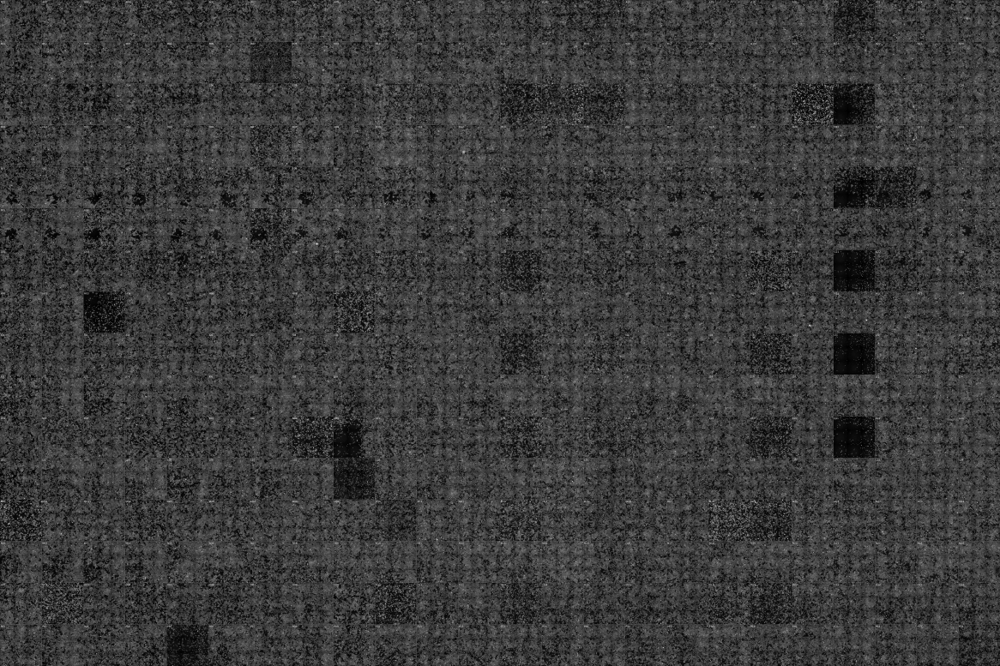
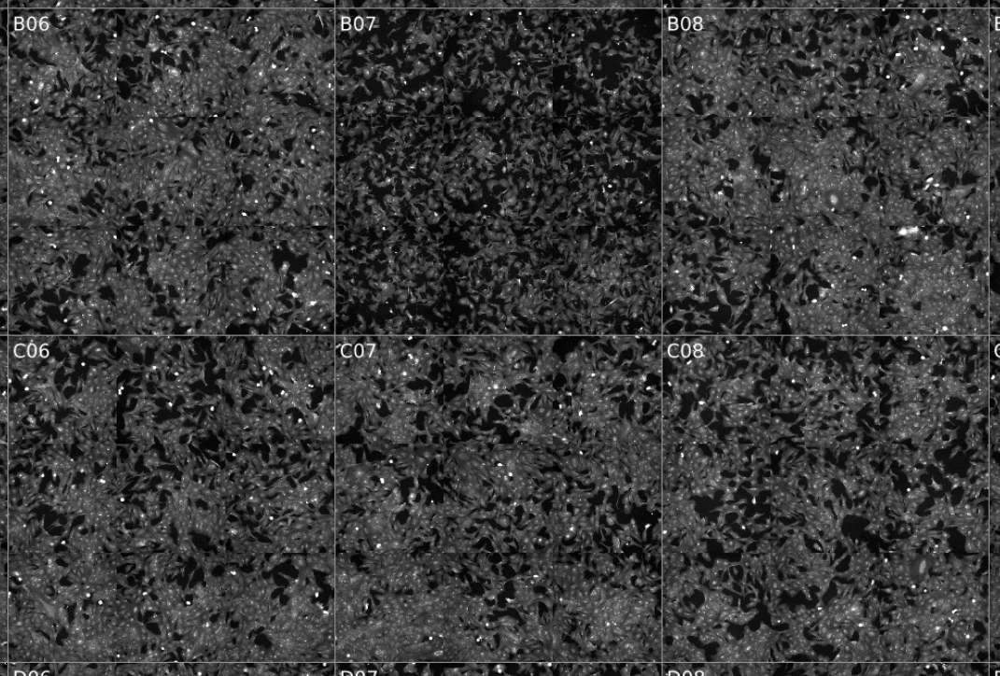

# Plate Inspector

This tool generates a visual overview of the images of a Cell Painting plate for quick quality assessment.

The generated image  gives an overview of the whole plate (scaled down, original size ~20MB per image with the default configuration):  


The Well Id is written in the top left corner of each well:  


The tool might also work for other cell assays, but was tested only with images from the [Cell Painting assay](https://www.nature.com/articles/nprot.2016.105).

Plate inspector expects a 384 well format and TIFF images. Well Ids (A01, C12, ...), microscope sites (1, 2, ...) and microscope channels (1-5) encoded in the image file names are matched by a configurable regex (see default configuration below), e.g. the following example file name of one microscope image

`"180706_A01_s5_w1B9D0B234-C57E-4A13-9664-D2CA89B4E7F8.tif"`

can be matched by this reges:

`"_(?P<well>[A-P]\d{2})_(?P<site>s[1-9])_(?P<channel>w[1-5])"`

to these fields: `well`: "A01", `site`: "5", `channel`: "1"

## Usage

The program takes images from one channel per run and generates the overview image for it. This makes it easy to parallelize the creation of overview images for multiple channels, e.g. on a cluster.

```
$ plate-inspector -h

Plate inspector, A visual inspector of Cell Painting plates.
Creates a single image overview of all individual images for the given channel.
v 0.3.1 (2022-03-09T16:34:09Z), by Axel Pahl. Written in Rust.

Configuration files in the `RON` format can be put
at <UserConfigDir>/plate-inspector.ron
or passed at the command line with the `-c` flag.
An example config file can be found at the root of this project.
If no config file is found, a default configuration is used.

Usage: target/release/plate-inspector IMAGE_DIR -w CHANNEL [-c CONFIG_FILE] [-o OUTPUT_FILE]

Example: target/release/plate-inspector queue/C2021-04-10.00-211126-A -w1 -o C2021-04-10.00-211126-A_w1.png

Options:
    -h, --help          print this help menu
    -s, --show-config   print the configuration and exit.
                        The output can be used to create a configuration file.
    -w NUMBER[1-5]      the microscope channel to analyze (REQUIRED, 1-5)
    -o, --output FILE   the overview output file to generate (PNG or JPG)
    -c, --config FILE   optional config file to load
```

## Configuration

A configuration file with the name `plate-inspector.ron` can be put in the default configuration directory (e.g. on Linux in `~/.config/`).
It can also be passed at the command line with the `-c`option (using any file name).

This is the default configuration:

```
ImageConfig(
    // The regex for the image file names
    // Matches e.g. the following image file name:
    // "180706_A01_s5_w1B9D0B234-C57E-4A13-9664-D2CA89B4E7F8.tif"
    // to well: "A01", site: "5", channel: "1"
    image_regex: r"_(?P<well>[A-P]\d{2})_(?P<site>s[1-9])_(?P<channel>w[1-5])",

    // The target sizes in pixels of each microscope image in the overview.
    // The final size of the overview image is then:
    // 24 * target_size_x * num_sites_x  BY  16 * target_size_y * num_sites_y
    target_size_x: 108,
    target_size_y: 108,

    // The number of microscope sites per well in X and Y
    num_sites_x: 3,
    num_sites_y: 3,

    // The program performs a contrast stretch to improve contrast.
    // Set the cutoff_high to lower values to get higher contrast.
    intensity_cutoff_low: 5,
    intensity_cutoff_high: 200,
    intensity_addition: 10
)
```

## Building and Installing

At the time of writing, a nightly [rust compiler toolchain](https://rustup.rs/) is required for building the project.  
Clone this repository, `cd` into it, then:

### Build the project

`cargo build --release`

### Run the program

target/release/plate-inspector

### Installation

The generated executable is self-contained and can be copied / linked to a location that is included in the system's path.